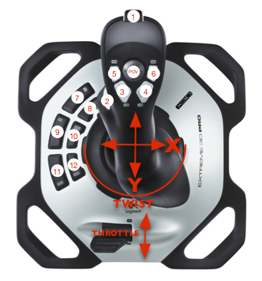

# Joystick layout



## Joystick 0: showStick

* __Button 1__: fire: _whileHeld_: ```new FireCommand(m_throatSubsystem, m_shooterSubsystem)```

* __Button 2__:

  * spinUp: _toggleWhenPressed_: ```new SpinUpShooterCommand(m_shooterSubsystem, m_shooterPower, m_backWheelPower, m_stick)```

  * turretTrack

* __Button 3__: intake: _whenReleased_: ```new RaiseIntake(m_intakeSubsystem, 0.25)```

* __Button 4__: unJumble: _whileHeld_: ```new UnJumbleCommand(m_intakeSubsystem, m_throatSubsystem, m_serializerSubsystem)```

* __Button 5__: serialize: _toggleWhenPressed_: ```new PowerSerializeCommand(m_serializerSubsystem, -0.3)```

* __Button 7__: moveTurrentL: _whileHeld_: ```new TurretMoveCommand(m_turretSubsystem, -0.6)```

* __Button 8__: moveTurrentR: _whileHeld_: ```new TurretMoveCommand(m_turretSubsystem, 0.6)```

## Joystick 1: stick

* __Button 12__: barrelPath: No actions configured

## Joystick 2: climbStick

* __Button POV DOWN__: decreaseTrim: No actions configured

* __Button POV UP__: increaseTrim: No actions configured

## Joystick 3: calibStick

* __Button 2__: calibrateShooter: _toggleWhenPressed_: ```new SpeedByThrottleCommand(m_shooterSubsystem, () -> m_calibStick.getThrottle())```

```commit feffb461949da85d7e0129fc2ff34f628d157b3b Merge: a518fbb a3a3e93 Author: Ryder Casazza <rydercasazza@gmail.com> Date:   Sat Mar 6 15:54:03 2021 -0800 Merge branch '2021-Layout-Code' of https://github.com/Paradox2102/2021-Infinite-Recharge-at-Home into 2021-Layout-Code ```

